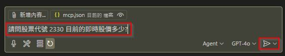
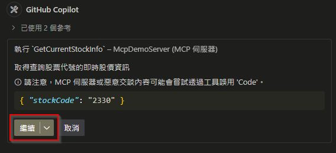
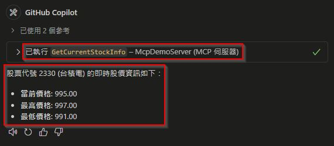

## 專案說明
### 1. 專案功能說明
本範例主要是在用 C# 語言撰寫實作 `MCP Server` 的範例程式，僅供學習之用。
主要的功能是可以讓使用者查詢台灣股票的資訊，主要有以下三個功能：
1. 輸入股票代號，查詢該股票的 `即時股價資訊`
2. 輸入股票代號及要查詢的日期，即可查詢該股票在 `該日期的歷史股價資訊`
3. 輸入股票代號及要查詢的月份，即可查詢該股票在 `該月份的歷史股價資訊`

### 2. 即時股價 API 串接說明
即時股價主要是用 [臺灣證券交易所](https://www.twse.com.tw/zh/) 提供的 API 來讀取資料

```
https://mis.twse.com.tw/stock/api/getStockInfo.jsp?json=1&delay=0&ex_ch=tse_股票代號.tw
```

例如：

```
https://mis.twse.com.tw/stock/api/getStockInfo.jsp?json=1&delay=0&ex_ch=tse_2330.tw
https://mis.twse.com.tw/stock/api/getStockInfo.jsp?json=1&delay=0&ex_ch=tse_2330.tw|tse_2331.tw
```

### 3. 歷史股價 API 串接說明
歷史股價主要是用 [臺灣證券交易所](https://www.twse.com.tw/zh/) 提供的 API 來讀取資料
```
http://www.twse.com.tw/exchangeReport/STOCK_DAY?response=csv&date=查詢日期&stockNo=股票代號
```

例如：

```
http://www.twse.com.tw/exchangeReport/STOCK_DAY?response=csv&date=20250501&stockNo=2330
```

### 4. 執行範例畫面截圖




